# V-Flow Installation Guide
Welcome to the installation guide for the V-Flow Fume Extraction System. This guide assumes the presence of a Voron 2.4 or Trident printer. By the end of this guide, you should have a fully operational V-Flow system, enhancing not only the air quality of your printing area but also the overall printing experience. Let's get started...

## Guide Topics/Index
This installation guide covers various aspects necessary for setting up the V-Flow system. Use the following topics as a quick reference to navigate through the guide. You can copy the topic of interest and use "Ctrl+F" (Windows/Linux) or "Command+F" (macOS) to find the relevant section quickly. 
- **STL File Structure** - Overview of the file organization and naming conventions.
- **Tools/Items Required** - List of tools and number of items needed for the assembly of the V-Flow system.
- **General Assembly Guide** - Step-by-step instructions for assembling the V-Flow components.
- **Enclosure Seal Guide** - Strategies and tips for enhancing your printer's enclosure integrity to maintain optimal temperatures.
- **Combined Exhaust Ventilation System (CEVS) Installation Guide** - Detailed guide on integrating the CEVS with your printer(s).
- **G-Code Configuration Guide** - Instructions for configuring your printer firmware to support the V-Flow system.


## Prerequisites for V-Flow System Installation
To successfully set up the V-Flow system, the following components are essential:
| Component | Description | Link |
|-----------|-------------|------|
| **Noctua NF-A6x25 Fan** | Recommended for its efficient airflow and quiet operation. ([Fume Extraction Analysis](Noctua-NF-A6x25-Fume_Extraction_Analysis.md)) | [View on Amazon](https://www.amazon.com/dp/B01K4HRLRI?psc=1&ref=ppx_yo2ov_dt_b_product_details) |
| **Dryer Vent Window Kit** | Designed for a 4-inch hose. Use `Window_Vent_Hose_Adapter.stl` from the `STL_FILES/Combined_Exhaust_Vent_System` folder for a 2.5-inch hose adapter. | [View on Amazon](https://www.amazon.com/gp/product/B0BXWH53M4/ref=ppx_yo_dt_b_search_asin_title?ie=UTF8&psc=1) |
| **2.5-inch Hose** | Connects the printer(s) to the window dryer vent. Available in 10ft lengths. | [View on Amazon](https://www.amazon.com/gp/product/B0C85G8P2R/ref=ppx_yo_dt_b_search_asin_title?ie=UTF8&psc=1) |
| **PG7 Cable Gland** | Attaches the CAN bus cable to the `Voron-M16_Cable_Gland_Housing.stl`. | [View on Amazon](https://www.amazon.com/uxcell-3mm-6-5mm-Waterproof-Adjustable-Locknut/dp/B08K8FB4KV/ref=sr_1_7?crid=3DUB7M4NL1SBC&keywords=pg7%2Bcable%2Bgland&qid=1707210582&sprefix=PG7%2Caps%2C167&sr=8-7&th=1) |
| **Molex Micro-Fit 3.0 (4 Pin) Connectors** | Allows for installation/disconnection of the CAN bus cable. **This specific type of connector is not a strict requirement**; any connector that fits through the `Voron-M16_Cable_Gland_Housing.stl` will work. [Example Photo](Reference_Images/Rear_Mounting_Plate-Canbus_Connector_Example.jpg)| [View on Amazon](https://www.amazon.com/Molex-Micro-Fit-Circuits-receptacle-Terminal/dp/B078Q798L9/ref=sr_1_3?crid=YGCXCXJKPD6H&keywords=microfit+3.0+connectors&qid=1707212019&sprefix=microfit+3.0+connectors%2Caps%2C152&sr=8-3) |
| **Molex Micro-Fit 3.0 (2 Pin) Connectors** | Facilitates the easy disconnection of the exhaust fan, simplifying the removal of the back panel for maintenance. | [View on Amazon](https://www.amazon.com/Molex-Micro-Fit-Circuits-receptacle-Terminal/dp/B078PZY6SM/ref=sr_1_5?crid=YGCXCXJKPD6H&keywords=microfit+3.0+connectors&qid=1707212019&sprefix=microfit+3.0+connectors%2Caps%2C152&sr=8-5) |
| **Silicon Mats** | For crafting one-way valves for the CEVS. Adding a valve on `Window_Vent_Hose_Adapter.stl` can prevent backdraft for single/dual printer setups (optional). | [View on Amazon](https://www.amazon.com/gp/product/B083TKTJS5/ref=ppx_yo_dt_b_search_asin_title?ie=UTF8&psc=1) |


## Recommended Mods
To enhance the performance of the V-Flow system and ensure optimal chamber temperature management, the following modifications are highly recommended:
- **Ellis Bed Fan Mod**: Essential for controlling chamber temperatures. This mod is crucial when using the V-Flow exhaust system. [Ellis Bed Fans Mod](https://github.com/VoronDesign/VoronUsers/tree/master/printer_mods/Ellis/Bed_Fans).
- **Clicky-Clack Fridge Door Mod**: A highly recommended addition for its superior sealing properties, plus it's just an awesome mod. [Clicky-Clack Door Mod](https://github.com/tanaes/whopping_Voron_mods/tree/main/clickyclacky_door).
- **RockNRoll Mod**: Facilitates easier access to the electronics compartment by allowing the printer to be rolled onto its back without damaging cables or the exhaust system. [RockNRoll Mod](https://mods.vorondesign.com/detail/tiIhFDTh9tHJY0JNJK9A).
- **ACM Panels**: For enhanced thermal management and durability, using Aluminum Composite Material (ACM) panels for the bottom and back of the enclosure is recommended.
- **Extrusion End Caps**: My creation, `Extrusion_End_Cap.stl`, available in `STL_FILES/Accessories_&_Tools`, seals the gaps at the extrusion joints on the top of the machine.
- **Z-Covers & Z-Plug**: Remixed parts, originals sourced from the internet. These parts seal gaps around the Z motors, specific to Voron 2.4. Available in the `STL_FILES/Accessories_&_Tools` folder.
- **Bed Wiring Grommet by LoCoCNC**: Organizes and protects bed wires, offering a cleaner setup and better seal. [Bed Wiring Grommet](https://mods.vorondesign.com/detail/PNilw0WXR7Qmhquj749iFg).


## STL File Structure
The STL files for the V-Flow system are organized into three main directories within the `STL_FILES` folder to facilitate easy navigation and part identification:
- **Accessories_&_Tools**: Contains general accessories and tools essential for the V-Flow system.
  - `Extrusion_End_Cap-x4.stl`
  - `Silicon_Cutting_Guide.stl`
  - `Magnet_Guide.stl`
  - `Z_Cover_A.stl` (Voron 2.4)
  - `Z_Cover_B.stl` (Voron 2.4)
  - `Z_Plug.stl` (Voron 2.4)
- **Combined_Exhaust_Vent_System**: The CEVS is for use with a dual pritner setup, combines their exhaust into one while preventing backflow.
  - `CEVS-Hose_Adapter-x3.stl`
  - `CEVS-Main_Hub.stl`
  - `Window_Vent_Hose_Adapter.stl` **(Note: This file is required for both single and dual printer setups.)**
- **Printer_Components**: Includes files specific to the Voron printer portion of the system.
  - `Voron-Exhaust_Fan_Shroud-5.5mm_Opening.stl`
  - `Voron-Exhaust_Fan_Shroud-8mm_Opening.stl`
  - `Voron-Fan_Interface_Ring.stl`
  - `Voron-Front_Mounting_Plate.stl`
  - `Voron-Hose_Adapter_Ring.stl`
  - `Voron-Rear_Mounting_Plate.stl`
    

### Tools/Items Required
- **Dialed-in 3D printer (Critical)**: **It's vital that your printer is well-calibrated and capable of printing objects with sharp angles, overhangs, bridging, and can accurately print with at least 0.1mm tolerances.** All the components of the V-Flow system are designed to be printed without support, but they still pose challenges due to their complex geometries and long print times. Ensuring your printer is optimized for bed adhesion and can accurately print these demanding features is essential for producing functional parts.
- Box cutter or sharp knife
- Wire cutters
- Soldering iron with heat inserts tip
- Allen wrenches
- Power drill & 9/64" drill bit
- Optional: Channel lock pliers (for pressing in magnets)
- Optional: Super glue (for securing magnets, if needed)


### Required Items for Single Printer Use
| Quantity | Item                                   | Link |
|----------|----------------------------------------|------|
| 16       | 6x3mm Magnets                          | [Amazon](https://www.amazon.com/gp/product/B0CDH2L6D7/ref=ppx_yo_dt_b_search_asin_title?ie=UTF8&psc=1) |
| 1        | Sealing Foam Tape (5mm wide, 3mm thick) | [Amazon](https://www.amazon.com/gp/product/B07L6LGMWC/ref=ppx_yo_dt_b_search_asin_title?ie=UTF8&psc=1) |
| 1        | Sealing Foam Tape (5mm wide, 1mm thick) | [Amazon](https://www.amazon.com/gp/product/B07L6M4PN1/ref=ppx_yo_dt_b_search_asin_title?ie=UTF8&th=1) |
| 1        | 58mm Diameter Silicon Cutout            | [Amazon](https://www.amazon.com/gp/product/B083TKTJS5/ref=ppx_yo_dt_b_search_asin_title?ie=UTF8&psc=1) |
| 14       | M3x5mm Heat Inserts                    | - |
| 7        | M3x8mm SHCS                            | - |
| 4        | M3x30mm SHCS                           | - |
| 3        | M3x12mm SHCS                           | - |
| 2        | M5x15mm SHCS                           | - |
| 2        | M5 T-nut for 2020 extrusion            | - |
| 2        | 2.5” Hose Clamps (included with the hose and vent) | - |

### Additional Items for the Combined Exhaust Ventilation System (CEVS):
| Quantity  | Item                                    | Link |
|-----------|-----------------------------------------|------|
| As needed | Additional 2.5-inch Hose                | [Amazon](https://www.amazon.com/gp/product/B0C85G8P2R/ref=ppx_yo_dt_b_search_asin_title?ie=UTF8&psc=1)  |
| 2         | 58mm Diameter Silicon Cutout            | [Amazon](https://www.amazon.com/gp/product/B083TKTJS5/ref=ppx_yo_dt_b_search_asin_title?ie=UTF8&psc=1) |
| 1         | Sealing Foam Tape (5mm wide, 1mm thick) | [Amazon](https://www.amazon.com/gp/product/B07L6M4PN1/ref=ppx_yo_dt_b_search_asin_title?ie=UTF8&th=1)   |
| 14        | M3x8mm SHCS                             | - |
| 14        | M3x5mm Heat Inserts                     | - |
| 3         | 2.5” Hose Clamps                        | - |


## General Assembly Guide
- Feel free to print the parts in any order that suits you. The most complex component, `CEVS-Main_Hub.stl`, benefits from an outside brim of at least 10mm for better bed adhesion. Ensure your printer has adequate cooling for parts with steep angles. You probably don’t need 40% infill for any of these parts, but I prefer my parts to be tough, adjust as you see fit.

### Print Settings
- **Material**: ABS/ASA
- **Infill Type**: Grid, Gyroid, Honeycomb, Triangle, or Cubic
- **Infill Percentage**: 20-40%
- **Nozzle Size**: 0.4mm
- **Layer Height**: 0.2mm
- **Extrusion Width**: 0.4mm
- **Wall Count**: 3-4
- **Solid Top/Bottom Layers**: 4-5

## Assembly Instructions
1. **Preparation**: Start by removing all side and top panels from your machine. Remove any existing exhaust plate/filter. Keep the back panel on or loosely connected.

2. **Voron-Rear Mounting Plate Assembly**:
   - Drill out the PTFE hole of the mounting plate using a 9/64” drill bit. Aim for a snug fit that allows easy removal of the PTFE tube.
   - Insert heat inserts into the mounting plate, with six on the front and three on the rear.
  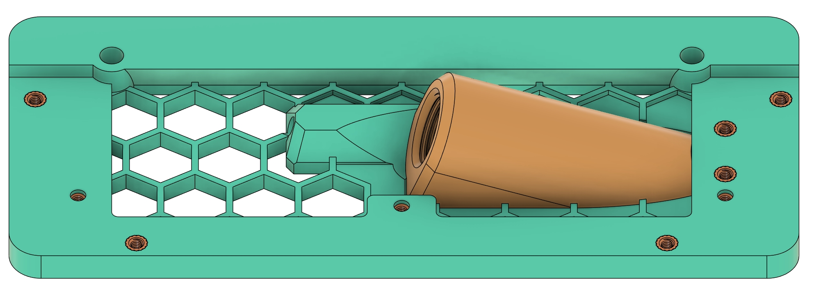 (Rear View) Make note of the orange M5 bolts and highlighted line - This is a 1mm foam tape guide used in a later step.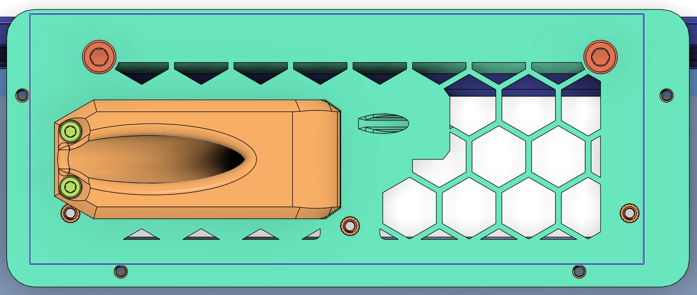
   - Attach `Voron-M16_Cable_Gland_Housing.stl` with two M3x8mm SHCS bolts to the mounting plate.

3. **Foam Tape - Front Side Application**:
   - Apply 1mm foam tape to the uppermost surface of the front face. Optionally, you may also add 1mm foam tape along the underside of the top lip for additional sealing, although this step is not mandatory. Recommend using wire cutters to cut the foam flush with the top surface if you do this step. 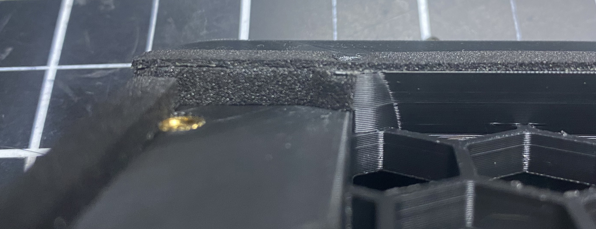
   - Apply the 3mm foam tape around the outside edges of the front face, bending the tape at corners. 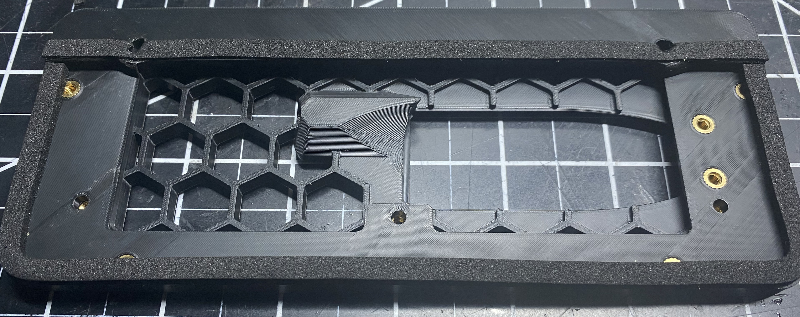

4. **Rear Side Application**:
   - Follow the highlighted/printed line referenced previously as a guide for the 1mm foam tape, keep to the inside of the line. 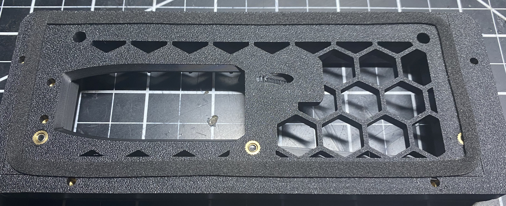

5. **Fan Shroud Preparation**:
   - There are two fan shroud versions: one with a 5.5mm opening and another with an 8mm opening, designed to accommodate the Can bus + USB cable by 3DO.
   - Insert heat inserts into the fan shroud and apply 1mm foam tape to the edge of the fan opening. 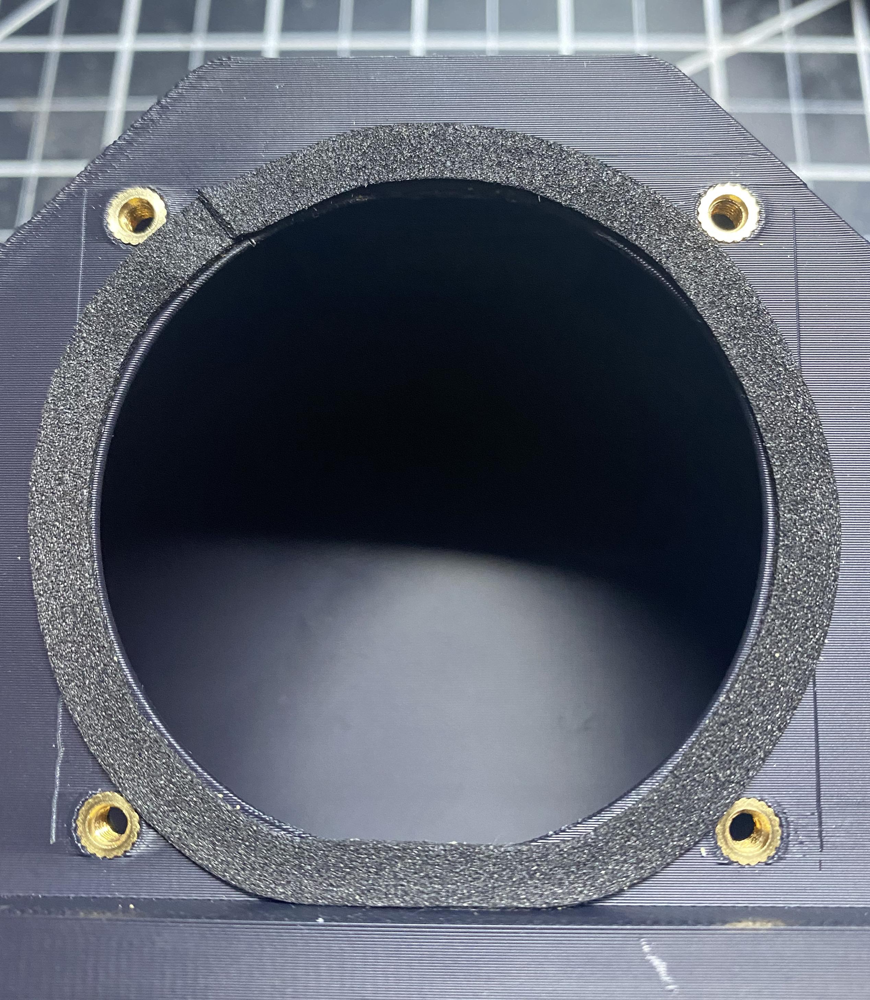
   - Drill out the PTFE hole (the smaller of the two left side holes) aiming for a tight yet practical fit.

6. **Fan Interface Ring and Hose Adapter Assembly**:
   - Start by integrating 8 6x3mm magnets into both the `Voron-Fan_Interface_Ring.stl` and `Voron-Hose_Adapter_Ring.stl`. It's crucial to ensure all magnets are oriented with the correct polarization for a strong connection. Use the `Magnet_Guide.stl` from the `STL_FILES/Accessories_&_Tools` folder for accurate placement. 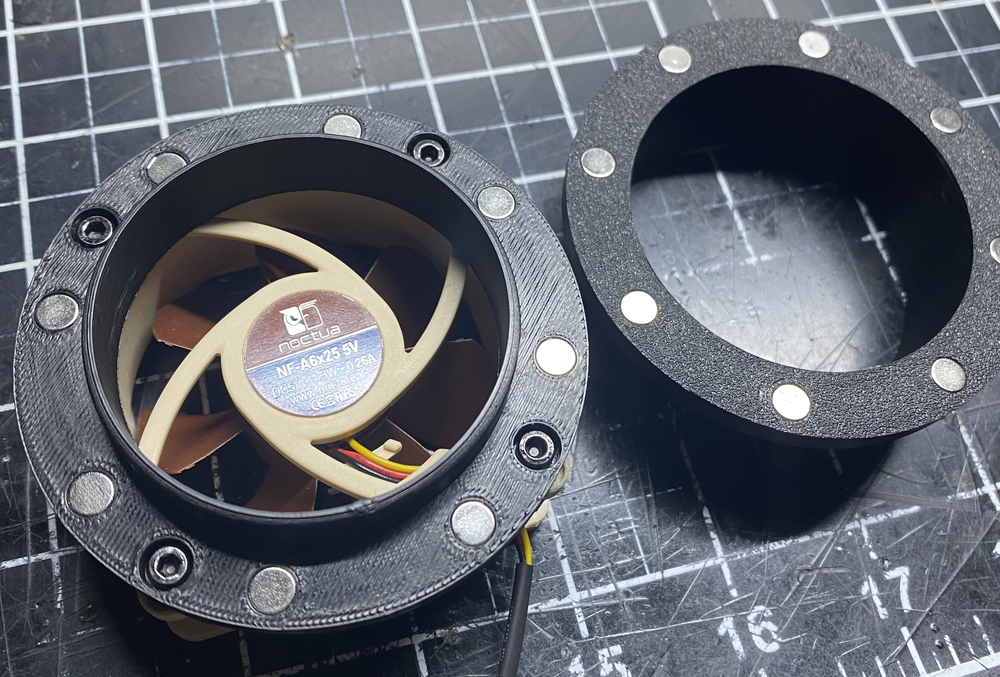
   - While superglue is usually unnecessary due to the magnets' tight fit, verify that each magnet sits flush against the part's surface. If fitting the magnets is difficult due to your printer's accuracy, gently press them into their slots with channel lock pliers.
   - Confirm the parts' magnetic connection by snapping together the `Voron-Fan_Interface_Ring.stl` and `Voron-Hose_Adapter_Ring.stl`. They should connect with a noticeable force. To separate the pieces, twist the hose adapter.

7. **Attaching the Noctua Fan**:
   - With the hose adapter set aside, secure a 60mm Noctua fan to the fan interface ring using four M3x30mm bolts. 
   - Use a box cutter or sharp knife to score the perimeter of the Noctua fan on the `Voron-Fan_Interface_Ring.stl` printed part as indicated in the photo. This scoring marks where to apply the 1mm thick foam tape for an airtight seal. 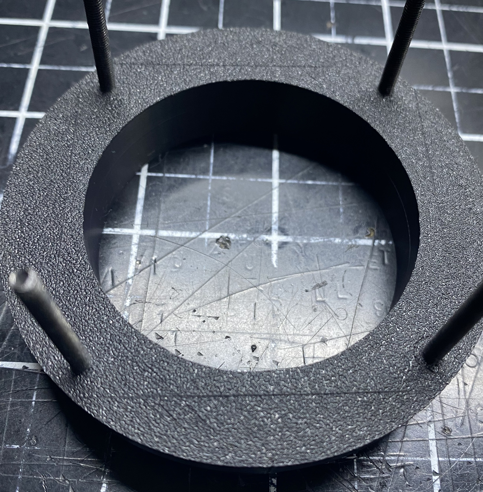
   - After applying the foam tape, trim any overhang with wire cutters for a clean edge. 
   - Proceed to mount the Noctua fan onto the fan shroud employing the same M3x30mm bolts. Exercise caution not to overtighten, the heat inserts were not inserted on the opposite side of the printed part, so you run the risk of pulling them out of the plastic. 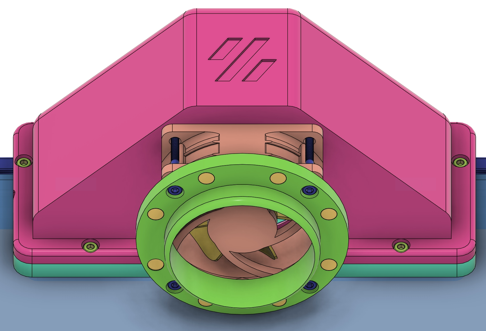

8. **Final Printer Assembly Steps**:
   - Start by inserting two M5 T-nuts into the 2020 extrusion at the back of your printer. Secure the rear mounting plate with two M5x15mm bolts but leave them slightly loose.
   - Next, attach the `Voron-Front_Mounting_Plate.stl` to the inside of the back panel using three M3x12mm bolts (shown in purple). Tighten these bolts along with the previously installed M5 bolts to compress the foam tape and ensure a tight seal. Use a flashlight to check for any gaps/light leaks between the foam tape and back plate. 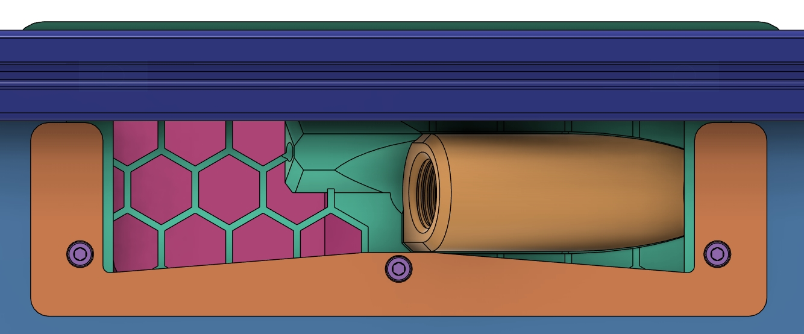
   - Prior to securing the fan shroud, it's recommended to integrate a detachable connector for the CAN bus cable to streamline future maintenance tasks. The `Voron-M16_Cable_Gland_Housing.stl`can fit a Micro-Fit 3.0 connector. This modification is crucial not only for convenience but also for ensuring the system remains organized and easily serviceable. Additionally, applying a similar approach to the Noctua fan's connection will further facilitate straightforward system adjustments and repairs. 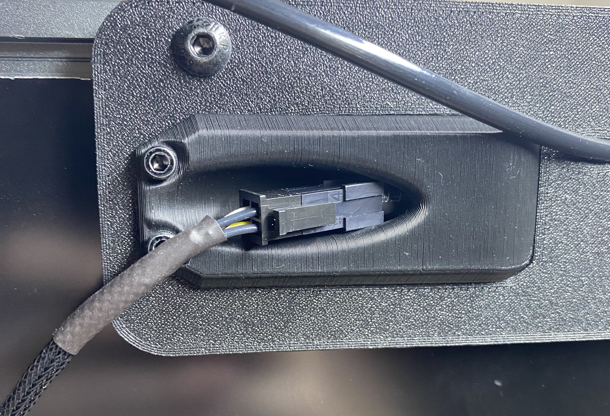
   - Attach the fan shroud to the mounting plate with 4 M3x8mm bolts. Ensure the foam tape compresses as you tighten the bolts for an airtight seal. 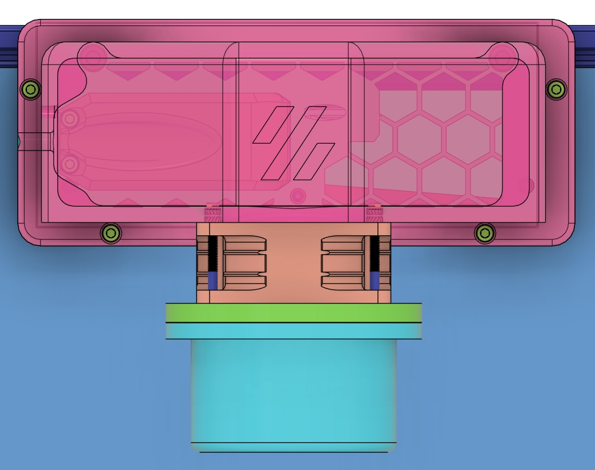
   - Finalize the main exhaust system by attaching the 2.5" hose to the hose adapter ring using a hose clamp, then connect it to the fan interface ring with a satisfying snap for a secure fit.
   - Here's the rear view of my Voron 2.4, showcasing the completed V-Flow system setup. To keep the cables neatly organized, I incorporated a printed cable raceway along the back. Within this raceway, I've equipped the Noctua fan with a connector, simplifying the disassembly process. 

9. **Dryer Window Vent Installation**:
    - For those operating a single printer setup, the final assembly step is to install the dryer window vent and connect it using the `Window_Vent_Hose_Adapter.stl`. To address potential backflow issues, incorporating a one-way valve into this adapter is recommended. A silicon cutting guide is available in the `STL_FILES/Accessories_&_Tools` folder. Crafting the silicon mat for the valve requires careful attention; use a sharp box cutter for accuracy. Once the main shape is cutout, make an incision in the center and push an M3X8mm bolt through the slit. After affixing a heat insert to the adapter, carefully screw in the bolt, ensuring the silicon remains flush against the adapter for the best seal.
     - To accommodate a range of dryer window vents and ensure a perfect fit, the Fusion360 file for the `Window_Vent_Hose_Adapter.stl` is included in the repository. This allows for easy adjustments to the adapter’s dimensions, ensuring compatibility with various vent designs. It can be found in the `STL_FILES/Combined_Exhaust_Vent_System` folder.


## Enclosure Seal Guide
To achieve the highest quality prints, especially with materials like ABS or ASA, it's essential to ensure your 3D printer's enclosure is properly sealed. This guide highlights crucial steps and components to enhance your printer's environment, maintaining stable temperatures and supporting efficient fume extraction.

1. **Seal the Bottom Panel**: 
   - A fundamental yet impactful strategy to curb heat loss involves sealing the bottom panel of your printer. Employing high-temperature resistant tape to cover any gaps markedly enhances heat retention within the chamber. For aesthetic considerations, it is recommended to apply the sealing tape to the underside of the bottom panel rather than the top.

2. **Install Foam Tape on All Panels**:
   - Ensuring that all panels, including side, top, and back, are properly sealed with foam tape is crucial. Adhere to Voron's recommendations and installation instructions for applying foam tape.

3. **Verify Panel Clips Functionality**:
   - It is imperative to ensure that the clips used to secure the panels to the printer are in proper working condition and applying sufficient force. Adequate tension by the clips is essential for maintaining the integrity of the seal, preventing any unattended gaps that could compromise the enclosure's thermal management. Regularly inspect and adjust the clips as needed to ensure a snug fit.

4. **Aluminum Composite Material**:
   - For enhanced thermal management, consider using ACM panels for the bottom and back of the enclosure. ACM panels offer superior heat retention and durability, further contributing to a stable printing environment.

5. **Maintain Temperature Control**: 
   - Adequate sealing allows the fume extraction system to function at full capacity without affecting the chamber's temperature adversely. The Ellis Bed Fan Mod becomes a critical component in achieving this synergy, as it enables effective temperature management alongside efficient fume extraction. This equilibrium is vital for the removal of fumes without deteriorating the internal chamber temperatues conducive to producing high-quality prints.

6. **Install Sealing Components**: 
   - Voron 2.4 and Trident printers benefit from specially designed components that reduce air leakage. These components can be found in the `STL_FILES/Accessories_&_Tools` directory:
     - `Extrusion_End_Cap-x4.stl`: Caps the ends of the frame extrusions, compatible with both Voron 2.4 and Trident printers.
     - `Z_Cover_A.stl` & `Z_Cover_B.stl`: Seals off the Z-axis motors on 2.4 printers.
     - `Z_Plug.stl`: Seals openings around the Z-axis belts on 2.4 printers.

Implementing these steps and utilizing the outlined components will markedly elevate your printer's performance. A meticulously sealed environment not only optimizes the functionality of the V-Flow Fume Extraction System but also significantly enhances the overall quality of prints.


## Combined Exhaust Ventilation System (CEVS) Installation Guide
  - The V-Flow system, designed for dual printer support, is a dynamic project with flexibility to scale. This guide details the current setup for the CEVS, however there is always potential for upgrades or new components to extend its capacity based on need/demand.
  	- The most challenging aspect being this guide is the printing of the `CEVS-Main_Hub.stl` file. This component is pre-oriented to print without the need for support, though a brim of at least 10mm is recommended for optimal bed adhesion. The same print settings and recommendations as previously mentioned apply here.

### CEVS Step-by-Step Installation
1. **Heat Inserts and Foam Tape Application**:
   - Begin by adding heat inserts to the CEVS Main Hub. Pay special attention to the highlighted rim around the fan opening, which serves as a guideline for applying 1mm thick foam tape to ensure a proper seal. 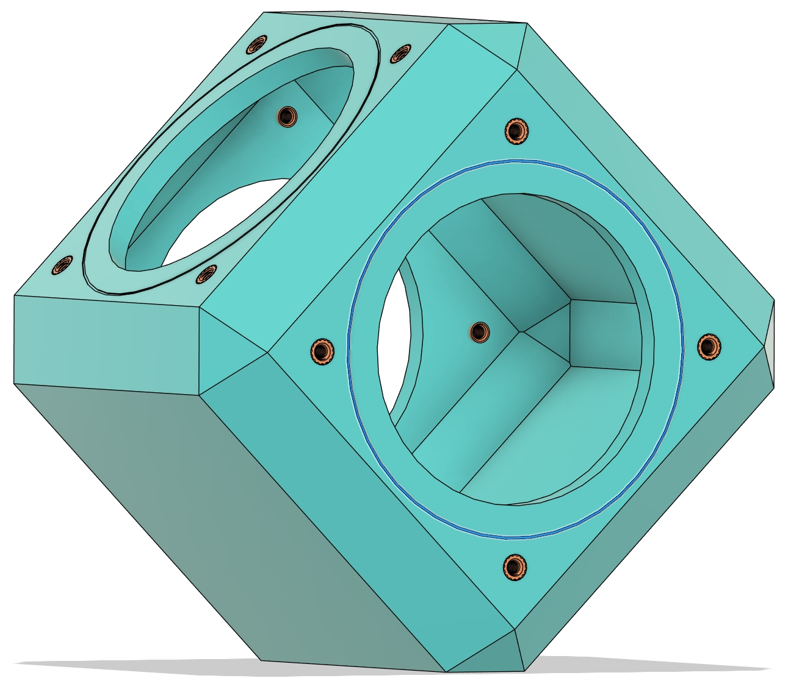 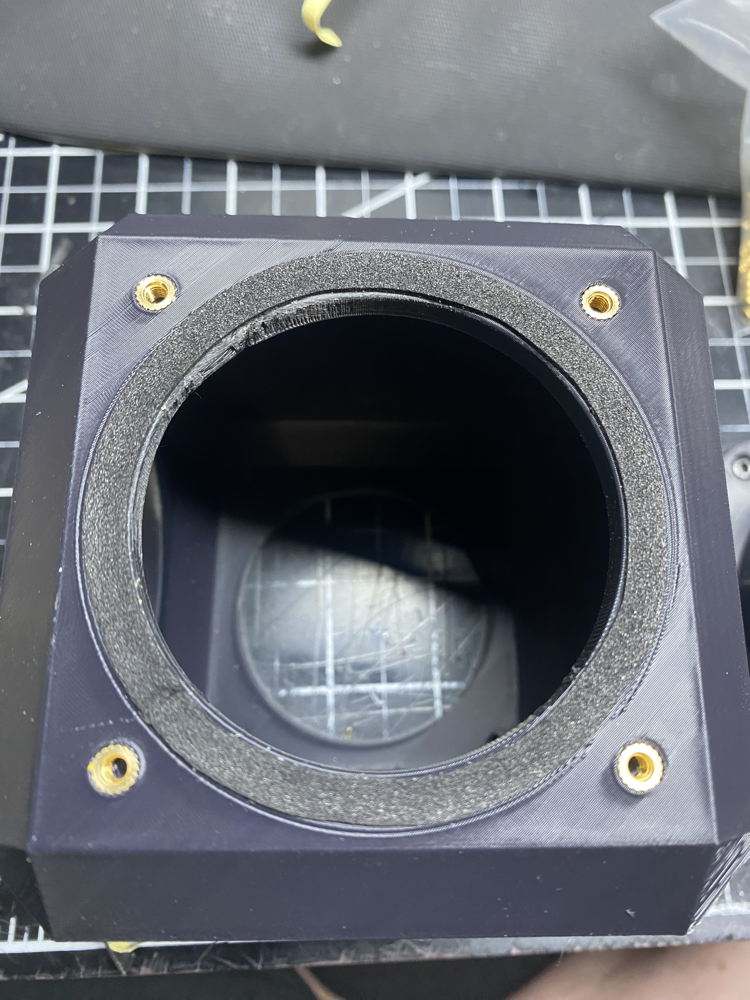

2. **Silicon One-Way Valves**:
   - Using the `Silicon_Cutting_Guide.stl` found in the `STL_FILES/Accessories_&_Tools` folder, craft two silicon one-way valves. Careful and precise cutting is essential. After cutting the main shape, make a central incision and insert an M3x8mm bolt through. Secure a heat insert to the adapter and screw in the bolt gently, keeping the silicon flush against the `CEVS-Hose_Adapter-x3.stl` for an optimal seal. 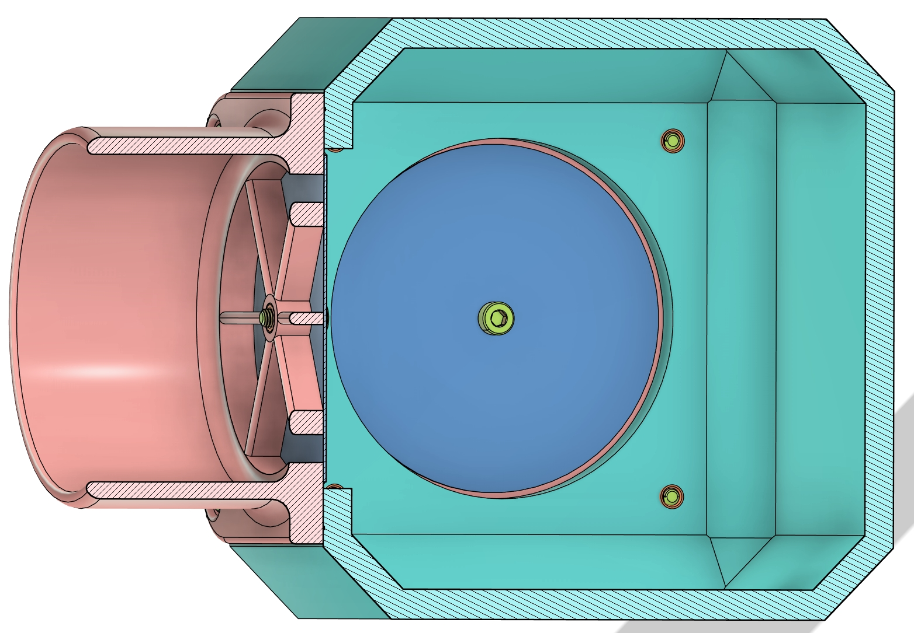

3. **Attaching Hose Adapters**:
   - Secure the hose adapters to the CEVS main hub using four M3x8mm bolts for each adapter. Tighten the bolts until the foam compresses and each adapter aligns flush with the hub's surface. 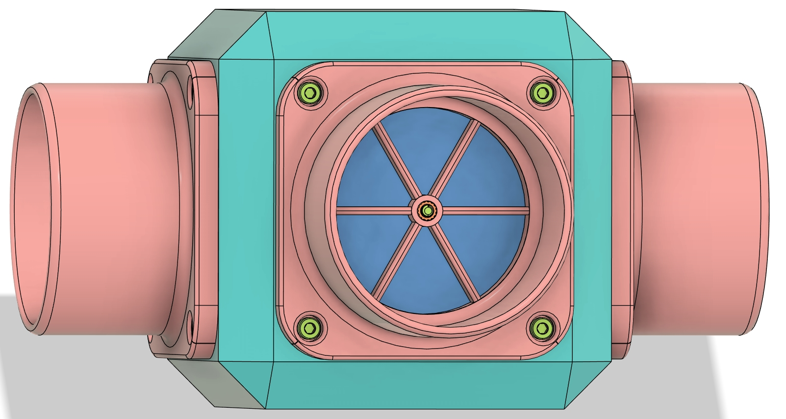
   - Attach the 2.5-inch hose to the adapters using hose clamps. **Important! - Each adapter connecting to a printer must be fitted with a silicon one-way valve. These valves are critical for preventing air from flowing from one printer to another when its fan is not in operation.**
   	- The correct positioning of the adapters and the one-way valves is crucial for their effective operation. They must be installed level, as uneven placement could lead to the silicon valves malfunctioning. A valve pointing upwards, for example, could flap downwards, compromising it’s ability to create a seal. Proper alignment, with all seals positioned horizontally, is essential for maintaining the desired airflow dynamics and preventing backflow.

**Congratulations on assembling your V-Flow system. This setup significantly improves air quality by efficiently managing printer fumes.**


# G-Code Configuration Guide
The detailed guide below demonstrates how to implement advanced temperature and fan control settings based on various parameters such as material type and bed/chamber temps. These examples provide an approach for those looking to optimize their printing process with tailored configurations. It builds upon the Ellis bedFan modification, enhancing it for this specific application. You can refer to the original modification [here](https://github.com/VoronDesign/VoronUsers/tree/master/printer_mods/Ellis/Bed_Fans).
- If you'd like a simplied exhaust fan control method, refer to the `Simplified Fan Controls` section at the bottom of this guide.

## Noctua Exhaust Fan Configuration
  - The configuration below sets up a generic fan in Klipper, naming it `Exhaust`. This fan is intended to run at 100% power for effective fume extraction but includes the `cycle_time` parameter for PWM control to adjust fan speed if necessary.
  - During testing I found that lowering the fan speed to below 50% caused it to emit unusual noises during operation. It's recommended to keep the fan running at full speed for optimal performance and to avoid potential noise issues.
	- Should you need to adjust the fan speed for any reason, consider testing different speeds carefully to find a balance between effective fume extraction and acceptable noise levels.
  - ### Important Note - Pinouts must be adjusted according to your specific hardware setup!!!
```ini
########## Exhaust Fan #########
# Configure the exhaust fan (Noctua case fan)
[fan_generic Exhaust]
pin: PA8               # Pin assignment for the exhaust fan
max_power: 1.0         # Maximum power output to the fan, allowing it to run at 100%
shutdown_speed: 0.0    # Fan speed upon shutdown, ensuring it turns off
kick_start_time: 5.0   # Time to kickstart the fan, necessary for reliable start-up
cycle_time: 0.00004    # Frequency for PWM signal (25kHz), allows speed control
```
 - We also define a macro to control the exhaust fan's operational parameters, including its speed and on/off state tracking.
```ini
[gcode_macro exhaustfanvars]
variable_speed_exhaust_fan: 1.0  # Default speed for the exhaust fan
variable_exhaust_on: 0           # Tracks the state of the exhaust fan (0 = off, 1 = on)
```
 - To control the exhaust fan, we use two macros: one to turn the fan on and another to turn it off. These macros adjust the fan's speed and update the fan's state accordingly. The last macro is used to turn the exhaust fan off in the print_end routine.
	- Each macro also triggers a monitoring loop by issuing a delayed G-code command `UPDATE_DELAYED_GCODE ID=bedfanloop DURATION=1`. This monitoring loop can adjust the bedFan speeds or take other actions based on the printer's current state.
```ini
[gcode_macro set_exhaust_on]
gcode:
    SET_FAN_SPEED FAN=Exhaust SPEED={printer["gcode_macro exhaustfanvars"].speed_exhaust_fan|float}
    SET_GCODE_VARIABLE MACRO=exhaustfanvars VARIABLE=exhaust_on VALUE=1
    UPDATE_DELAYED_GCODE ID=bedfanloop DURATION=1  # Initiates the monitoring loop

[gcode_macro set_exhaust_off]
gcode:
    SET_FAN_SPEED FAN=Exhaust SPEED=0
    SET_GCODE_VARIABLE MACRO=exhaustfanvars VARIABLE=exhaust_on VALUE=0
    UPDATE_DELAYED_GCODE ID=bedfanloop DURATION=1  # Initiates the monitoring loop

[delayed_gcode STOP_EXHAUST_DELAYED]
gcode:
    SET_EXHAUST_OFF
```


## BedFans Configuration
  - For managing the temperature of the chamber, another set of fans, referred to as `BedFans`, are configured. The BedFans are designed to distribute heat from the bed heater, significantly improving chamber temperature uniformity and heating efficiency. 
```ini
########## Bed Fans #########
[fan_generic BedFans]  # Configuration for bed fans
pin: PD14              # Pin used for the bed fans
kick_start_time: 0.5   # Time to kickstart the fans
```
 - We define variables to manage the operation of the BedFans, including the temperature thresholds and speeds for different conditions. **These is where you'd adjust the BedFan settings (such as fan power) to fit your needs.**
```ini
[gcode_macro bedfanvars]
variable_threshold_temp: 100      # Temperature threshold to enable/disable fans
variable_speed_temp_reached: 0.6  # Fan speed once the target bed temperature is reached
variable_speed_heating_up: 0.2    # Fan speed while the bed is heating up
variable_speed_exhaust_on: 1.0    # Fan speed when the exhaust fan is active
```
 - Additionally, macros are set up to adjust the BedFans speed based on the bed temperature and whether the exhaust fan is running. This allows for better chamber temperature control, ensuring optimal printing conditions.
```ini
[gcode_macro BedFansSlow]
gcode:
    
    
    
    
    

    # Check if bed heater is active and above the threshold
    
        # Adjust fan speed based on the exhaust fan status
        
            SET_FAN_SPEED FAN=BedFans SPEED={speed_exhaust_on}
        
            SET_FAN_SPEED FAN=BedFans SPEED={speed_heating_up}
        
    
        SET_FAN_SPEED FAN=BedFans SPEED=0  # Turn off BedFans if bed heater is off or below threshold
    

[gcode_macro BedFansFast]
gcode:
    
    
    
    
    
    

    # Check if bed temperature is near the target and heater is active
    
        # Adjust fan speed based on the exhaust fan status
        
            SET_FAN_SPEED FAN=BedFans SPEED={speed_exhaust_on}
        
            SET_FAN_SPEED FAN=BedFans SPEED={speed_temp_reached}
        
    
        SET_FAN_SPEED FAN=BedFans SPEED=0
    

[gcode_macro BedFansOff]
gcode:
    
    
    
    

    # Check if the bed heater is active
    
        # Adjust fan speed based on the exhaust fan status
        
            SET_FAN_SPEED FAN=BedFans SPEED={speed_exhaust_on}
        
            SET_FAN_SPEED FAN=BedFans SPEED=0
        
    
        SET_FAN_SPEED FAN=BedFans SPEED=0  # Turn off BedFans if bed heater is off or below threshold
    
```
 - Lastly, we introduce command overrides to incorporate bed and exhaust fan logic into the printer's temperature management routines. This includes modifications to heater temperature settings, wait-for-temperature commands, and fan speed adjustments based on ongoing temperature readings.
```ini
############ Command overrides ############
# Override, set fan speeds to low and start monitoring loop.
[gcode_macro SET_HEATER_TEMPERATURE]
rename_existing: _SET_HEATER_TEMPERATURE
gcode:
    # Parameters
    
    
    # Vars
    
    
    
        M104 S{TARGET}
    
        M99140 S{TARGET}
    
        {action_respond_info("Heater %s not supported" % HEATER)}
    

    # Set fans to low if heater_bed temp is requested above threshold temp and kick off monitoring loop.
    
        
            BedFansSlow
            UPDATE_DELAYED_GCODE ID=bedfanloop DURATION=1
        
            BedFansOff
            UPDATE_DELAYED_GCODE ID=bedfanloop DURATION=0 # Cancel bed fan loop if it's running
        
    

# Override M190 (Wait for Bed Temperature)
# As a bonus, use TEMPERATURE_WAIT so we don't have to wait for PID to level off.
[gcode_macro M190]
rename_existing: M99190
gcode:
	# Parameters
	
	# Vars
	
	
	
		BedFansSlow																# >= Threshold temp: Low speed fans while heating 
	
		BedFansOff																# < Threshold temp: Turn bed fans off
	                                        

	M140 {'%s%s' % (p, params[p])}																	# Set bed temp
	  
	
		TEMPERATURE_WAIT SENSOR=heater_bed MINIMUM={S|int} MAXIMUM={S|int + 5}	# Wait for bed temp within 5 degrees
	

	# Post-heating fan speeds
									    
		BedFansFast																# >= Threshold temp: Higher speed fans after heating finished
	
	
# Replace M140 (Set Bed Temperature) to just be an alias of SET_HEATER_TEMPERATURE (which has associated bed fan logic if enabled)
[gcode_macro M140]
rename_existing: M99140
gcode:
	# Parameters
	
	
	SET_HEATER_TEMPERATURE HEATER=heater_bed TARGET={S}
	
# Replace TURN_OFF_HEATERS
[gcode_macro TURN_OFF_HEATERS]
rename_existing: _TURN_OFF_HEATERS
gcode:
	BedFansOff
	_TURN_OFF_HEATERS
```


## Monitoring Loop 
 - The monitoring loop ensures that the BedFans are adjusted in real-time, based on the current bed temperature and the status of the exhaust fan. 
	- This loop is a critical component of the temperature management system, providing continuous feedback and adjustments to maintain the desired chamber conditions.
```ini
################ Monitoring loop #####################
# Turns bed fans to the appropriate speed based on bed temperature and exhaust fan status.
[delayed_gcode bedfanloop]
gcode:
    # Vars
    
    
    
    
    
    
    

    # Check if the bed heater is off (TARGET is 0)
    
        SET_FAN_SPEED FAN=BedFans SPEED=0  # Turn off BedFans if the bed heater is off
    
        # If bed heater is on, determine BedFans speed based on temperature and exhaust fan status
        
            
                
                    SET_FAN_SPEED FAN=BedFans SPEED={SPEED_EXHAUST_ON}
                
                    SET_FAN_SPEED FAN=BedFans SPEED={SPEED_TEMP_REACHED}
                
            
                SET_FAN_SPEED FAN=BedFans SPEED={SPEED_HEATING_UP}
            
        
    

    # Schedule next check if bed heater is active
    
        UPDATE_DELAYED_GCODE ID=bedfanloop DURATION=5
    
```


## Implementing Exhaust Fan Control in the Print_Start Routine
This section outlines how to integrate advanced temperature management and fan control based on the material type and other parameters passed from a Slicer to Klipper firmware.
  - To pass variables from a particular Slicer to Klipper you must use the custom slicer settings in its print_start G-code. In the example below I am using Orca Slicer. **The code required will change depending on what slicer you're using!**
  - Insert the following line in Orca Slicer's custom start G-code section. This command below passes the initial layer temperatures, filament type, and chamber temperature to Klipper, which can be utilized in your print_start macro.
```ini
gcode:
START_PRINT EXTRUDER=[nozzle_temperature_initial_layer] BED=[bed_temperature_initial_layer_single] FILAMENT_TYPE=[filament_type] CHAMBER=[chamber_temperature]
```
 - To use the variables in Klipper you must define them in your print_start macro in your printer.cfg file.
```ini
[gcode_macro print_start]
gcode:
    # Variables passed from the slicer
    
    
    
    
```
 - An example of how this can be useful, the code below turns on the exhaust fan if the material is either ABS/ASA. It also adjusts the offset of my nozzle if the material is PETG.
```ini
    # Material-dependent settings
    RESPOND MSG="Material: {MATERIAL}"
    
        # PLA does not require special handling
    
        SET_GCODE_OFFSET Z_ADJUST=0.020 MOVE=1  ; Adjust Z offset for PET
    
        SET_EXHAUST_ON  ; Enable exhaust fan for materials that require it
    
```
 - Another example of advanced parameter passing, managing extruder and bed temperatures. In the code below I set the bed_temp but do not wait for the temperature to be reached. Instead, I perform homing and QGL and then return conduct a bed heatsoak. While this order of operations is a matter of preference the key is the command `UPDATE_DELAYED_GCODE ID=bedfanloop DURATION=1`, which initiates a monitoring loop for the bedFans.
	- This loop is essential for keeping the bedFans at lower speeds during the heating phase and then increasing their speed to a predetermined level once the target temperature is achieved. This also enables speed adjustment in conjunction with the fume extraction system, turning them to a predetermined speed once the exhaust fan is turned on/off. 
```ini
# Initial temperature setting for bed and extruder without delay
SET_HEATER_TEMPERATURE HEATER=heater_bed TARGET={BED_TEMP} WAIT=false
SET_HEATER_TEMPERATURE HEATER=extruder TARGET={EXTRUDER_TEMP} WAIT=false

# Initiating bed fan loop for effective temperature control
UPDATE_DELAYED_GCODE ID=bedfanloop DURATION=1
```
 - The subsequent example illustrates the application of this approach during bed heatsoak procedures, extending also to chamber heatsoak processes. In my testing I've found that it's necessary to call `UPDATE_DELAYED_GCODE ID=bedfanloop DURATION=1` anytime the bed_temp is adjusted. Pay close attention to where it's being called in the code below and try to implement this in your start macro.
```ini
    # 3 ----- BED HEATSOAK -------------------------------------
    STATUS_HEATING
    
        
            M106 S255  ; Turn on parts cooling fan to max for chamber temperature management
        
        # Heatsoak the bed and wait, then update the bed fan loop
        HEATSOAK_BED TEMP={BED_TEMP} SOAKTIME={SOAK} WAIT=true
        UPDATE_DELAYED_GCODE ID=bedfanloop DURATION=1
    
        # Wait for the bed to reach the target temperature if no heatsoak is required
        TEMPERATURE_WAIT SENSOR=heater_bed MINIMUM={BED_TEMP}
        UPDATE_DELAYED_GCODE ID=bedfanloop DURATION=1
    

  # ----- CHAMBER HEATSOAK ----------------------------------
 # If a setpoint is defined and a sensor available, then we wait to reach the chamber temperature
    STATUS_HEATING
    
        
            # Wait for the temperature of the chamber to be reached (default max: 15min)
            
                RESPOND MSG="Waiting for target chamber temperature"
            
            HEATSOAK_CHAMBER TEMP={CHAMBER_TEMP} MAXTIME={CHAMBER_MAXTIME}
            UPDATE_DELAYED_GCODE ID=bedfanloop DURATION=1
        
    
```


## Print_End Routine with Exhaust Fan Delayed Shutdown
  - The last consideration is the print_end routine. We want to ensure that the exhaust fan continues to run after the print ends for enough time to exchange the air and remove any remaining ABS/ASA fumes. The code below runs the exhaust fan for 15 minutes and is placed at the very bottom of my print_end macro.
```ini
[gcode_macro print_end]
gcode:
    # Parameters for delayed exhaust shutdown (default 15 minutes)
    
    
    # Schedule the exhaust fan to turn off after the specified delay
    UPDATE_DELAYED_GCODE ID=STOP_EXHAUST_DELAYED DURATION={EXHAUST_TIME}
```


## Simplified Fan Controls
  - If you're looking for a more straightforward solution instead of using the complex conditional logic and variable passing from the slicer, you can directly command the exhaust fan to turn on/off at a specific point in your print start/end routines via the `SET_EXHAUST_ON` & `SET_EXHAUST_OFF` commands.
```ini
[gcode_macro print_start]
gcode:
    # Simplified fan control
    SET_EXHAUST_ON  ; Turn on the exhaust fan at the start of the print

    # Remaining print_start script below...

[gcode_macro print_end]
gcode:
    # Simplified fan control
    SET_EXHAUST_OFF  ; Turn off the exhaust fan at the end of the print
```


### Guidance for Next Steps
1. **Test Configuration:** After implementing these configurations, perform test prints to ensure that the exhaust and bedFans operate as expected. Monitor the chamber and bed temperatures to verify that they remain within desired ranges.
2. **Adjust Parameters:** Based on test print results and your observations, adjust the fan speeds, temperature thresholds, and other parameters as necessary to optimize printing conditions for your specific setup.
3. **Documentation:** Keep detailed notes on any changes made to the configuration for future reference or troubleshooting.
   
## Conclusion
  - Whether you choose the advanced method for precise control based on specific parameters or the simplified approach for ease of use, both strategies provide effective ways to manage your printing environment's air quality. The advanced settings offer customization and optimization for various materials and conditions, while the simplified method ensures basic ventilation needs are met with minimal setup.


## Support
- Feel free to reach out to me on discord at okashiikuusou if you have any additional questions not covered in this guide.


# Acknowledgements
- The `Voron-Rear_Mounting_Plate.stl` is a component I've remixed. The `Voron-M16_Cable_Gland_Housing.stl` stl remains unchanged. Both are from the umbilical passthrough mod by [whopping_Voron_mods](https://github.com/tanaes/whopping_Voron_mods/tree/main/umbilical_passthrough)
- Inspiration for the one-way valve feature comes from the 2.4 Window Ventilation System available on [TeamFDM](https://www.teamfdm.com/files/file/463-24-window-ventilation-system/).
- The quick connect mechanism was inspired by The Aluminum Carpenter's [YouTube video](https://www.youtube.com/watch?v=LfHVOZGakTQ).
