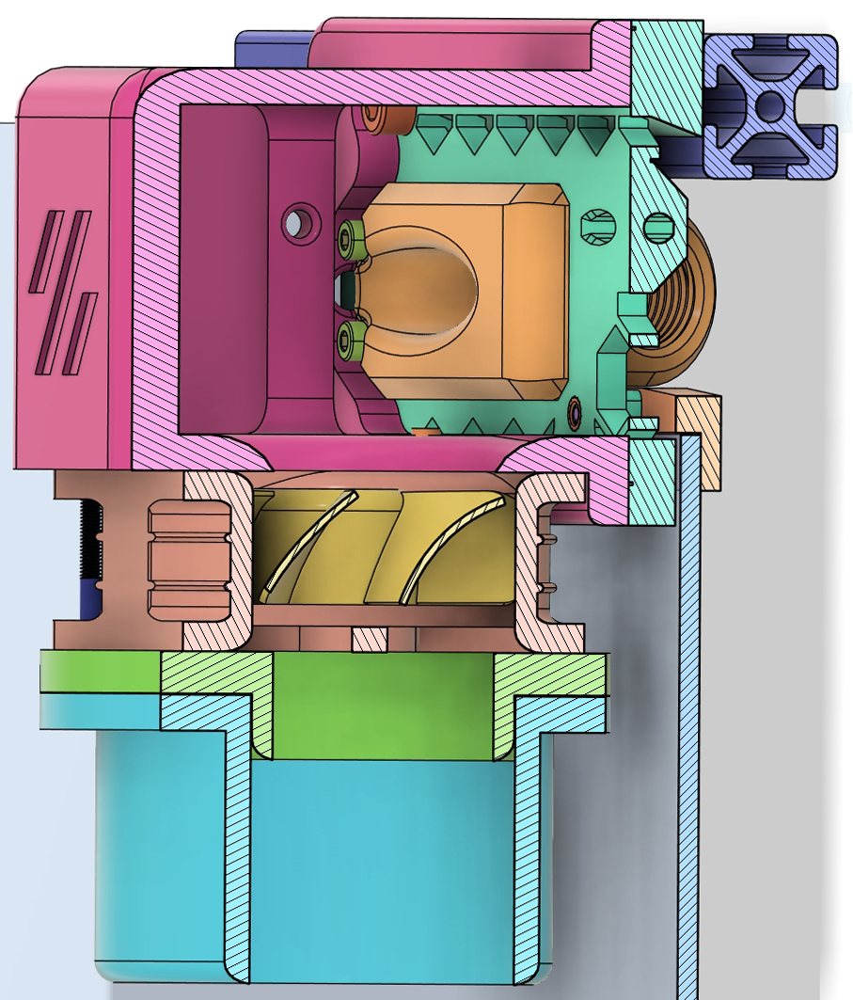
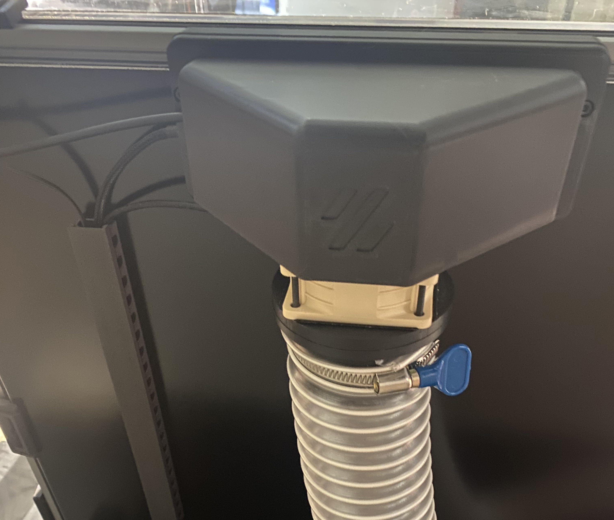

# V-Flow
A Fume Extraction System made for Voron 2.4 and Trident 3D printers. Enhance your 3D printing environment by safely managing and redirecting fumes outdoors, ensuring a clean and healthy workspace.

## Key Features
- **Direct Fume Extraction:** Routes ABS/ASA fumes outside, ensuring cleaner workspace air.
- **Ease of Assembly:** All components are designed to be printed without the need for support using Voron recommended print settings.
- **Quick Disconnect:** Enables effortless hose detachment for hassle-free maintenance.
- **Adhesive-Free Seal:** Facilitates easy installation and removal, enhancing convenience.
- **Dual Printer Compatibility:** Designed to work seamlessly with a second printer, the system includes the Combined Exhaust Ventilation System (CEVS) for integrating two printers into a single exhaust setup, effectively preventing backflow.
- **Better Cable Management:** By routing the CAN bus & PTFE cable out the exhaust port and the back of the machine, it provides a more aesthetically pleasing and clean look.

# Installation Guide
Please follow the detailed steps in the [Installation Guide](Installation_Guide.md) to set up your V-Flow System.

## Prerequisites for V-Flow System Installation
To successfully set up the V-Flow system, the following components are essential:
| Component | Description | Link |
|-----------|-------------|------|
| **Sanyo Denki 9GA0612P1H03 Fan** | Recommended for its improved static pressure. ([Upgraded Fan/Noctua Replacement](Noctua-NF-A6x25-Fume_Extraction_Analysis.md)) | [View on Digikey](https://www.digikey.com/en/products/detail/sanyo-denki-america-inc/9GA0612P1H03/6192282) |
| **Dryer Vent Window Kit** | Designed for a 4-inch hose. Use `Window_Vent_Hose_Adapter.stl` from the `STL/Combined_Exhaust_Vent_System` folder for a 2.5-inch hose adapter. | [View on Amazon](https://www.amazon.com/gp/product/B0BXWH53M4/ref=ppx_yo_dt_b_search_asin_title?ie=UTF8&psc=1) |
| **2.5-inch Hose** | Connects the printer(s) to the window dryer vent. Available in 10ft lengths. | [View on Amazon](https://www.amazon.com/gp/product/B0C85G8P2R/ref=ppx_yo_dt_b_search_asin_title?ie=UTF8&psc=1) |
| **PG7 Cable Gland** | Attaches the CAN bus cable to the `PG7_Cable_Gland.stl`. | [View on Amazon](https://www.amazon.com/uxcell-3mm-6-5mm-Waterproof-Adjustable-Locknut/dp/B08K8FB4KV/ref=sr_1_7?crid=3DUB7M4NL1SBC&keywords=pg7%2Bcable%2Bgland&qid=1707210582&sprefix=PG7%2Caps%2C167&sr=8-7&th=1) |
| **Molex Micro-Fit 3.0 (4 Pin) Connectors** | Allows for installation/disconnection of the CAN bus cable. **This specific type of connector is not a strict requirement**; any connector that fits through the `PG7_Cable_Gland.stl` will work. [Example Photo](Images/Rear_Mounting_Plate-Canbus_Connector_Example.jpg)| [View on Amazon](https://www.amazon.com/Molex-Micro-Fit-Circuits-receptacle-Terminal/dp/B078Q798L9/ref=sr_1_3?crid=YGCXCXJKPD6H&keywords=microfit+3.0+connectors&qid=1707212019&sprefix=microfit+3.0+connectors%2Caps%2C152&sr=8-3) |
| **Molex Micro-Fit 3.0 (2 Pin) Connectors** | Facilitates the easy disconnection of the exhaust fan, simplifying the removal of the back panel for maintenance. | [View on Amazon](https://www.amazon.com/Molex-Micro-Fit-Circuits-receptacle-Terminal/dp/B078PZY6SM/ref=sr_1_5?crid=YGCXCXJKPD6H&keywords=microfit+3.0+connectors&qid=1707212019&sprefix=microfit+3.0+connectors%2Caps%2C152&sr=8-5) |
| **Silicon Mats** | For crafting one-way valves for the CEVS. Adding a valve on `Window_Vent_Hose_Adapter.stl` can prevent backdraft for single/dual printer setups (optional). | [View on Amazon](https://www.amazon.com/gp/product/B083TKTJS5/ref=ppx_yo_dt_b_search_asin_title?ie=UTF8&psc=1) |

## Recommended Mods
To enhance the performance of the V-Flow system and ensure optimal chamber temperature management, the following modifications are highly recommended:
- **Ellis Bed Fan Mod**: Essential for controlling chamber temperatures. This mod is crucial when using the V-Flow exhaust system. [Ellis Bed Fans Mod](https://github.com/VoronDesign/VoronUsers/tree/master/printer_mods/Ellis/Bed_Fans).
- **Clicky-Clack Fridge Door Mod**: A highly recommended addition for its superior sealing properties, plus it's just an awesome mod. [Clicky-Clack Door Mod](https://github.com/tanaes/whopping_Voron_mods/tree/main/clickyclacky_door).
- **RockNRoll Mod**: Facilitates easier access to the electronics compartment by allowing the printer to be rolled onto its back without damaging cables or the exhaust system. [RockNRoll Mod](https://mods.vorondesign.com/detail/tiIhFDTh9tHJY0JNJK9A).
- **ACM Panels**: For enhanced thermal management and durability, using Aluminum Composite Material (ACM) panels for the bottom and back of the enclosure is recommended.
- **Extrusion End Caps**: My creation, `Extrusion_End_Cap.stl`, available in `STL/Accessories_&_Tools`, seals the gaps at the extrusion joints on the top of the machine.
- **Z-Covers & Z-Plug**: Remixed parts, originals sourced from the internet. These parts seal gaps around the Z motors, specific to Voron 2.4. Available in the `STL/Accessories_&_Tools` folder.
- **Bed Wiring Grommet by LoCoCNC**: Organizes and protects bed wires, offering a cleaner setup and better seal. [Bed Wiring Grommet](https://mods.vorondesign.com/detail/PNilw0WXR7Qmhquj749iFg).

## Contributions
  - If you have improvements or bug fixes, please submit a pull request or open an issue.

## License
  - This project is licensed under the [GNU General Public License v3.0](LICENSE).

# Acknowledgements
- The `Rear_Mounting_Plate.stl` is a remixed component. The cable gland STL's remains unchanged. They're from the umbilical passthrough mod by [whopping_Voron_mods](https://github.com/tanaes/whopping_Voron_mods/tree/main/umbilical_passthrough)
- Inspiration for the one-way valve feature comes from the 2.4 Window Ventilation System available on [TeamFDM](https://www.teamfdm.com/files/file/463-24-window-ventilation-system/).
- The quick connect mechanism was inspired by The Aluminum Carpenter's [YouTube video](https://www.youtube.com/watch?v=LfHVOZGakTQ).

